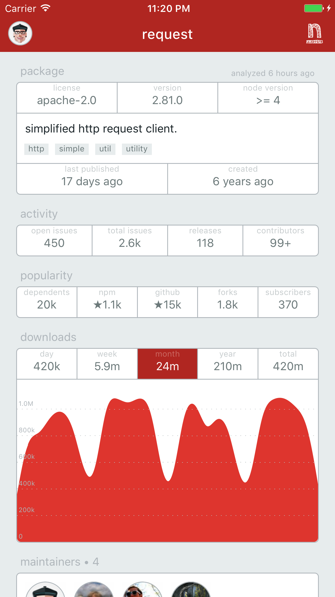
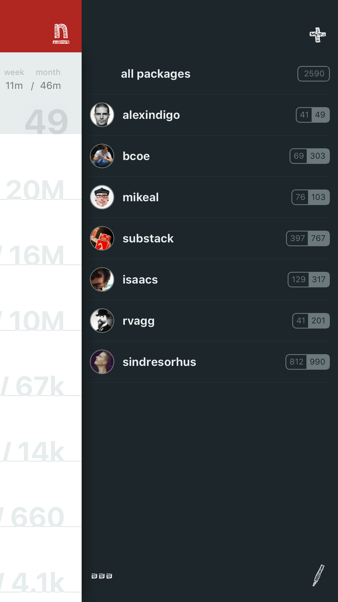
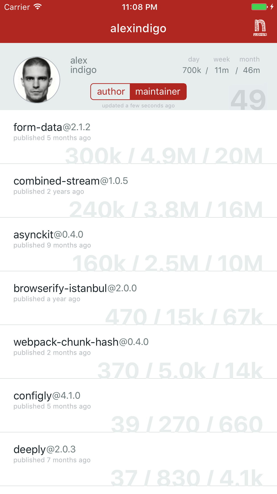

# ndash

Your npm dashboard!

## about

This application allows you to see what your public node modules are up to,
and take a peek at other developers, you collaborate with.

## thanks

Awesome APIs are provided by [npmjs.com](http://www.npmjs.com/) and [npms.io](http://www.npms.io/),
without them this project wouldn't exist. Thanks a lot folks.

## disclaimer

This is not an official `npmjs.com` or `npms.io` app, just utilizes their publicly accessible APIs for the benefits of the `nodejs` community.

## nuts & bolts

This application is released under the [MIT](LICENSE) license.
Source code available at [github.com/alexindigo/ndash](https://github.com/alexindigo/ndash).

## screenshots

   
